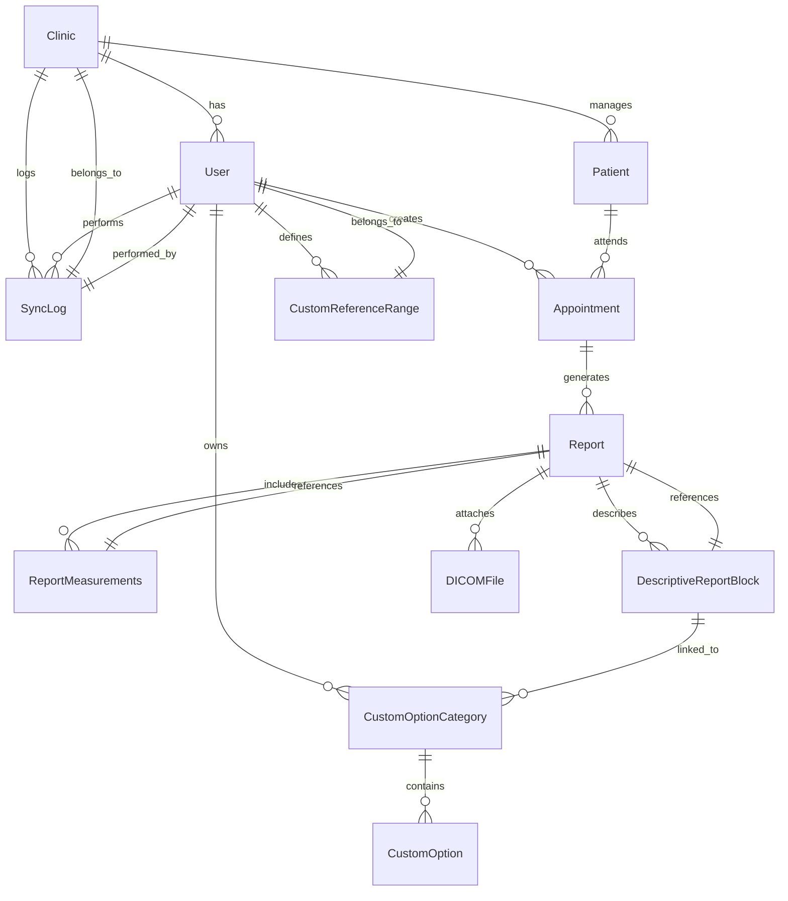

# HeartBeat Database Specification

# A4: Conceptual Data Model

## Brief Presentation of Goals

The conceptual data model for HeartBeat aims to provide a robust, secure, and flexible structure to support the creation of structured echocardiogram medical reports.

The focus of the MVP is entirely on accelerating and standardizing report creation, allowing doctors to customize reference ranges and descriptive blocks while ensuring clinical accuracy and offline capabilities.

The model also ensures:
- Strict relational integrity between patients, reports, and measurements.
- Automatic calculations for derived ventricular functions and relations.
- Fully customizable reference ranges and descriptive report blocks, managed by each cardiologist.
- Offline-first approach, with full data synchronization and conflict resolution handled transparently when back online.

## 1. Class Diagram

### Main Entities and Attributes

1. **Clinic**
   - `id`: UUID (Primary Key)
   - `name`: Clinic name
   - `address`: Clinic address
   - `created_at`: Timestamp
   - `updated_at`: Timestamp

2. **User**
   - `id`: UUID (Primary Key)
   - `clinic_id`: UUID (Foreign Key → Clinic.id, nullable for sys_admin)
   - `name`: Full name
   - `cpf`: Taxpayer Registration Number (unique, required)
   - `phone`: WhatsApp number (unique, required)
   - `email`: Email address (unique, optional)
   - `password`: Password (hashed)
   - `role`: ENUM(`cardiologist`, `clinic_admin`, `sys_admin`)
   - `created_at`: Timestamp
   - `updated_at`: Timestamp

3. **Patient**
   - `id`: UUID (Primary Key)
   - `clinic_id`: UUID (Foreign Key → Clinic.id)
   - `name`: Full name
   - `social_name`: Social name (optional)
   - `birth_date`: Date of birth
   - `gender`: ENUM(`male`, `female`, `other`)
   - `cpf`: Taxpayer Registration Number (unique per clinic)
   - `phone`: Phone number (optional)
   - `email`: Email address (optional)
   - `height_cm`: Height in cm (optional)
   - `weight_kg`: Weight in kg (optional)
   - `notes`: General notes (optional)
   - `sync_status`: ENUM(`pending`, `synced`, `error`)
   - `created_at`: Timestamp
   - `updated_at`: Timestamp

4. **Appointment**
   - `id`: UUID (Primary Key)
   - `patient_id`: UUID (Foreign Key → Patient.id)
   - `clinic_id`: UUID (Foreign Key → Clinic.id)
   - `professional_id`: UUID (Foreign Key → User.id)
   - `requesting_physician`: Requesting physician (free text)
   - `procedure_type`: ENUM(`transthoracic`, `transesophageal`, `stress_echo`, `vascular`)
   - `operator`: Health insurance / operator (optional)
   - `plan`: Health plan (optional)
   - `external_guide_number`: External guide number (optional)
   - `registration_number`: Patient registration number (optional)
   - `notes`: Notes (optional)
   - `appointment_date`: Timestamp
   - `status`: ENUM(`scheduled`, `completed`, `canceled`)
   - `sync_status`: ENUM(`pending`, `synced`, `error`)
   - `created_at`: Timestamp
   - `updated_at`: Timestamp

5. **Report**
   - `id`: UUID (Primary Key)
   - `appointment_id`: UUID (Foreign Key → Appointment.id)
   - `clinical_data`: Clinical history (anamnese)
   - `diagnosis`: Diagnostic impression
   - `pdf_file_path`: File path or URL for PDF
   - `sync_status`: ENUM(`pending`, `synced`, `error`)
   - `created_at`: Timestamp
   - `updated_at`: Timestamp

6. **ReportMeasurements**
   - `report_id`: UUID (Primary Key → Report.id)

   #### Manual Measurements:
   - `aorta_root_diameter_mm`
   - `left_atrium_diameter_mm`
   - `right_ventricle_diameter_mm`
   - `lv_diastolic_diameter_mm`
   - `lv_systolic_diameter_mm`
   - `septum_thickness_mm`
   - `posterior_wall_thickness_mm`

   #### Automatically Calculated Measurements:
   - `ae_volume_index_ml_m2`
   - `lv_diastolic_index_mm_m2`
   - `lv_diastolic_index_mm_height`
   - `lv_end_diastolic_volume_ml`
   - `lv_end_systolic_volume_ml`
   - `ejection_fraction_simpson_pct`
   - `ejection_fraction_teicholz_pct`
   - `shortening_fraction_percent`
   - `lv_mass_g`
   - `lv_mass_index_g_m2`
   - `lv_mass_index_g_m`
   - `lv_relative_wall_thickness_cm`
   - `lv_erp_mass_ratio`

   #### Flexible Measurements:
   - `extra_measurements`: JSONB (optional)

   - `created_at`: Timestamp
   - `updated_at`: Timestamp

7. **DescriptiveReportBlock**
   - `id`: UUID (Primary Key)
   - `report_id`: UUID (Foreign Key → Report.id)
   - `block_type`: ENUM(`anatomical_structure`, `conclusion`, `technical_comment`)
   - `block_name`: Block title (e.g., \"Átrio Direito\")
   - `content`: Descriptive content (text)
   - `order`: Display order in report
   - `created_at`: Timestamp
   - `updated_at`: Timestamp

8. **CustomOptionCategory**
   - `id`: UUID (Primary Key)
   - `user_id`: UUID (Foreign Key → User.id)
   - `name`: Category name (e.g., \"Ritmo\", \"Conclusão\")
   - `type`: ENUM(`measurement`, `text_block`)
   - `created_at`: Timestamp
   - `updated_at`: Timestamp

9. **CustomOption**
   - `id`: UUID (Primary Key)
   - `category_id`: UUID (Foreign Key → CustomOptionCategory.id)
   - `shortcut_key`: Integer key (e.g., 1, 2, 3...)
   - `label`: Shortcut label (e.g., \"Normal\")
   - `value`: Text to insert when shortcut is used
   - `created_at`: Timestamp
   - `updated_at`: Timestamp

10. **CustomReferenceRange**
    - `id`: UUID (Primary Key)
    - `user_id`: UUID (Foreign Key → User.id)
    - `measurement_name`: Name of the measurement (e.g., \"Aorta Raiz\")
    - `normal_min`: Lower bound of normal range
    - `normal_max`: Upper bound of normal range
    - `unit`: ENUM(`mm`, `cm`, `ml`, `ml/m²`, `g`, `g/m²`, `g/m`, `%`, `L/min`)
    - `notes`: Additional notes (optional)
    - `created_at`: Timestamp
    - `updated_at`: Timestamp

11. **DICOMFile**
    - `id`: UUID (Primary Key)
    - `report_id`: UUID (Foreign Key → Report.id)
    - `file_name`: File name
    - `file_path`: File path (local/cloud)
    - `metadata`: JSONB (optional)
    - `sync_status`: ENUM(`pending`, `synced`, `error`)
    - `created_at`: Timestamp
    - `updated_at`: Timestamp

12. **SyncLog**
    - `id`: UUID (Primary Key)
    - `clinic_id`: UUID (Foreign Key → Clinic.id)
    - `user_id`: UUID (Foreign Key → User.id)
    - `sync_type`: ENUM(`patient`, `appointment`, `report`, `dicom`, `pdf`)
    - `status`: ENUM(`success`, `error`)
    - `details`: Text log
    - `timestamp`: Timestamp

# A5: Relational Schema, Validation, and Schema Refinement

## 1. Relational Schema (Compact Notation)

| Relation                | Compact Notation                                                                                                                                                                                   |
|-------------------------|-----------------------------------------------------------------------------------------------------------------------------------------------------------------------------------------------------|
| Clinic                  | Clinic(id PK, name, address, created_at, updated_at)                                                                                                                                               |
| User                    | User(id PK, clinic_id FK, name, cpf UNIQUE, phone UNIQUE, email UNIQUE, password, role ENUM, created_at, updated_at)                                                                               |
| Patient                 | Patient(id PK, clinic_id FK, name, social_name, birth_date, gender ENUM, cpf UNIQUE, phone, email, height_cm, weight_kg, notes, sync_status ENUM, created_at, updated_at)                          |
| Appointment             | Appointment(id PK, patient_id FK, clinic_id FK, professional_id FK, requesting_physician, procedure_type ENUM, operator, plan, external_guide_number, registration_number, notes, appointment_date, status ENUM, sync_status ENUM, created_at, updated_at) |
| Report                  | Report(id PK, appointment_id FK, clinical_data, diagnosis, pdf_file_path, sync_status ENUM, created_at, updated_at)                                                                                |
| ReportMeasurements      | ReportMeasurements(report_id PK FK, aorta_root_diameter_mm, left_atrium_diameter_mm, right_ventricle_diameter_mm, lv_diastolic_diameter_mm, lv_systolic_diameter_mm, septum_thickness_mm, posterior_wall_thickness_mm, ae_volume_index_ml_m2, lv_diastolic_index_mm_m2, lv_diastolic_index_mm_height, lv_end_diastolic_volume_ml, lv_end_systolic_volume_ml, ejection_fraction_simpson_pct, ejection_fraction_teicholz_pct, shortening_fraction_percent, lv_mass_g, lv_mass_index_g_m2, lv_mass_index_g_m, lv_relative_wall_thickness_cm, lv_erp_mass_ratio, extra_measurements JSONB, created_at, updated_at) |
| DescriptiveReportBlock  | DescriptiveReportBlock(id PK, report_id FK, block_type ENUM, block_name, content, order, created_at, updated_at)                                                                                   |
| CustomOptionCategory    | CustomOptionCategory(id PK, user_id FK, name, type ENUM, created_at, updated_at)                                                                                                                   |
| CustomOption            | CustomOption(id PK, category_id FK, shortcut_key, label, value, created_at, updated_at)                                                                                                            |
| CustomReferenceRange    | CustomReferenceRange(id PK, user_id FK, measurement_name, normal_min, normal_max, unit ENUM, notes, created_at, updated_at)                                                                        |
| DICOMFile               | DICOMFile(id PK, report_id FK, file_name, file_path, metadata JSONB, sync_status ENUM, created_at, updated_at)                                                                                     |
| SyncLog                 | SyncLog(id PK, clinic_id FK, user_id FK, sync_type ENUM, status ENUM, details, timestamp)                                                                                                          |

## 2. Domains and Units

### Units (ENUM):
- `mm`
- `cm`
- `ml`
- `ml/m²`
- `g`
- `g/m²`
- `g/m`
- `%`
- `L/min`

## 3. Schema Validation and Normalization

- All relations are in **BCNF**.
- Fields marked as `UNIQUE` or `NOT NULL` are validated at the database level.
- `ReportMeasurements` calculated fields are **populated automatically** by backend logic and **cannot** be edited manually.
- `CustomReferenceRange` values are **user-specific** in the current version and enforce valid ranges based on medical literature or custom inputs.

# A6: Indexes, Triggers, Transactions, and Database Population

## 1. Predicted System Load

| Relation               | Order of Magnitude | Estimated Growth |
|------------------------|--------------------|------------------|
| Clinic                 | Dozens             | Low              |
| User                   | Hundreds           | Medium           |
| Patient                | Thousands          | High             |
| Appointment            | Tens of thousands  | High             |
| Report                 | Hundreds of thousands | High          |
| ReportMeasurements     | Hundreds of thousands | High          |
| DescriptiveReportBlock | Hundreds of thousands | High          |
| DICOMFile              | Millions           | Very High        |
| SyncLog                | Millions           | Medium           |

---

## 2. Proposed Indexes

| Index   | Relation              | Attribute                 | Type   | Justification                                  |
|---------|-----------------------|---------------------------|--------|------------------------------------------------|
| IDX01   | Patient               | name, birth_date          | B-tree | Fast patient search                            |
| IDX02   | Report                | appointment_id            | B-tree | Quick report retrieval                         |
| IDX03   | ReportMeasurements    | report_id                 | B-tree | Ensure quick access to measurements            |
| IDX04   | DescriptiveReportBlock| report_id                 | B-tree | Performance on assembling descriptive report   |
| IDX05   | CustomOption          | category_id               | B-tree | Fast retrieval of shortcut options             |
| IDX06   | CustomReferenceRange  | measurement_name, user_id | B-tree | Efficient lookup for user reference ranges     |

---

## 3. Triggers

- **Auto-calculate ReportMeasurements derived fields**  
  On INSERT or UPDATE of the 7 manual fields in `ReportMeasurements`, backend logic **calculates** and **updates** the 13 derived fields automatically.

- **Sync status management**  
  On INSERT or UPDATE of any record in Patient, Appointment, Report, ReportMeasurements, or DescriptiveReportBlock, update `sync_status` to `pending`.

---

## 4. Transactions

- **Transactional control** on report creation:  
  INSERT into Report → INSERT into ReportMeasurements → INSERT DescriptiveReportBlocks  
  → If any step fails, rollback everything to maintain consistency.

- **Sync Transactions**:  
  Handle multi-record sync as a transaction, ensuring full success or rollback to avoid partial sync states.

---

## 5. Database Population (for Testing and Production)

- **Testing datasets** with patients, appointments, and reports, including:
  - Dummy users (cardiologists, clinic admins)
  - Synthetic patients with realistic demographics
  - Predefined CustomOptionCategories and CustomOptions
  - Sample reports with manual and calculated measurements filled in

- **Production consideration**:
  - Encryption on sensitive fields (patients’ cpf, phone, email)
  - Predefined CustomReferenceRanges based on scientific guidelines (e.g., ASE 2023)

# A7: Entity-Relationship Diagram (ERD)

The following diagram represents the core entities, their attributes, and relationships in the HeartBeat database.

